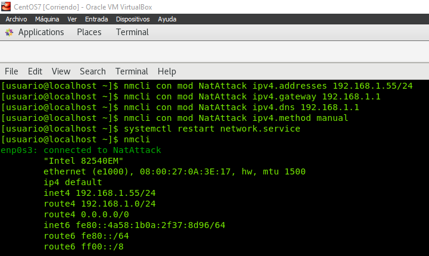
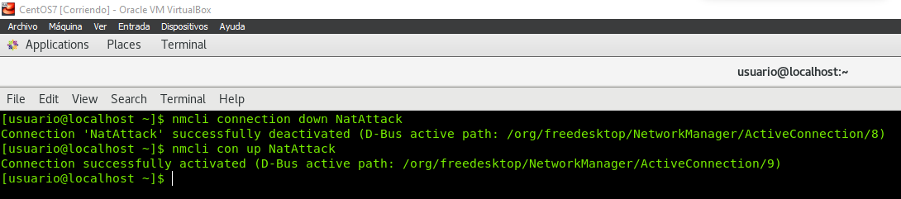
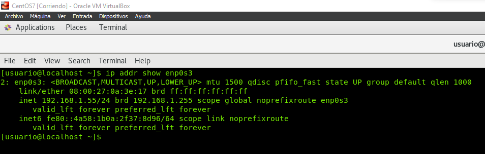
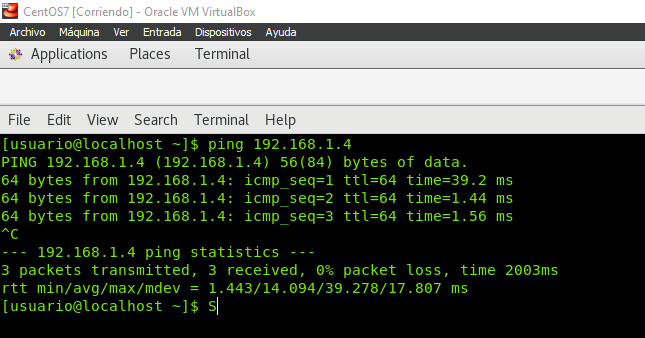
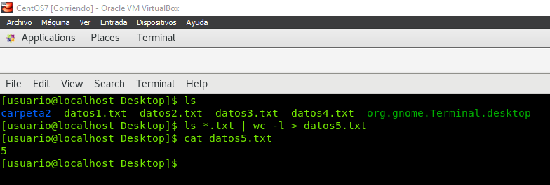
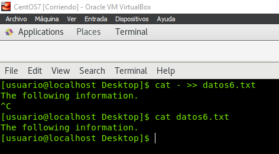
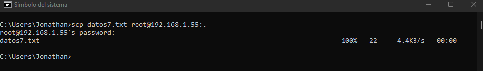
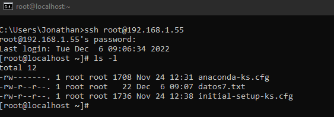
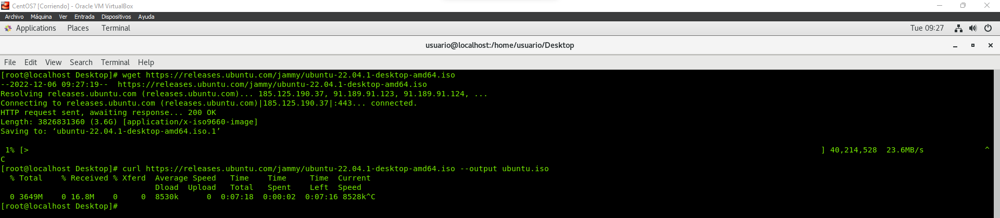
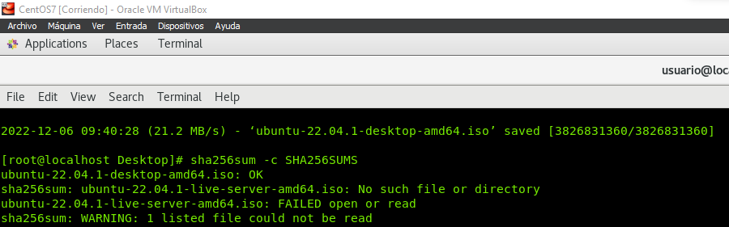

# COMANDOS LINUX - RED

## 1. Set static IP on your Linux device to connect to your LAN using nmcli command

Cambiar dirección IP:

`nmcli connection modify NatAttack ipv4.addresses 192.168.1.55/24`

Cambiar puerta de enlace:

`nmcli con mod NatAttack ipv4.gateway 192.168.1.1`

Cambiar DNS:

`nmcli con mod NatAttack ipv4.dns 192.168.1.1`

Cambiar a red estática:

`nmcli con mod NatAttack ipv4.method manual`

Aplicar cambios/reiniciar servicio de red:

`systemctl restart network.service`

o

`nmcli con up NatAttack`

## 2. Disable network interface with nmcli

Desactivar interfaz:

`nmcli connection down NatAttack`

## 3. Activate the nmcli network interface

Activar interfaz:

`nmcli con up NatAttack`

## 4. Check with the ip command your configuration

Mostrar configuración IP de la interfaz:

`ip addr show enp0s3`

## 5. Do ping to nodes on your network

> Recuerda cambiar el tipo de interfaz.

Conexión con red local:

`ping 192.168.1.4`

## 6. Lists all .txt files in the current directory and then counts those .txt files and saves the output to a new file

Mostrar todos los .txt:

`ls *.txt`

Contar por lineas:

`wc -l`

Guardar resultado en otro fichero:

`ls *.txt | wc -l > datos5.txt`

## 7. Create a file from scratch on Linux and include the following information

Crear fichero y escribir en él:

`cat - datos6.txt >>`

## 8. Copy it from another host on your network

Copiar y enviar a otra máquina:

`scp datos7.txt 192.168.1.55:.`

## 9. Connect to the other host and verify that it has been created

Conectarse a otra máquina:

`ssh root@192.168.1.55`

## 10. Download from ubuntu website page the ISO with wget command and curl command

Descargar un archivo:

`wget https://cualquier.iso`

`curl https://cualquier.iso --output mi.iso`

## 11. Download and confirm that the downloaded file is correct (SHA256SUM) from the same page

Comprobar SHA256SUM:

`sha256sum -c SHA256SUMS.TXT`

